# Experimento de seguridad
Este repositorio contiene la solución al experimento de seguridad del curso de Arquitecturas ágiles de software. El proyecto fue realizado utilizando [Python](https://www.python.org/downloads/) versión 3.12.4.

## Prerrequisitos
Para poder utilizar este proyecto necesitas:

* [Python](https://www.python.org/)

## Tecnologías y herramientas a usar
* [Python 3.12](https://www.python.org/)
* [PyCharm](https://www.jetbrains.com/es-es/pycharm/) o  [Visual Studio Code](https://code.visualstudio.com/) (IDE para Python)
* [Postman](https://www.postman.com/)


## Estructura

```
📦 Experimento.
│   .gitignore
│   README.md
│   requirements.txt
├───autorizador
│   └─ app.py
├───receptor_de_pqrs
│   └─ app.py
└───registro
    └─ app.py
```


| Componente       | Descripción |
| ---------------- | ----------- |
| registro         | Microservicio encargado de registrar un usuario y encriptar su información. |
| autorizador      | Microservicio encargado de administrar la sesión del usuario y verificar la validez del `Código OTP` y del `Token`. |
| receptor_de_pqrs | Microservicio encargado de guardar y obtener la información confidencial de los PQRs **(se necesita un token válido del autorizador para poder utilizarlo)**. |
| requirements.txt | Archivo donde se detallan las dependencias necesarias para ejecutar el proyecto. |

## Instalación (Linux/MacOS)

Ubicarse en la raíz del proyecto dónde se encuentra el archivo [README.md](README.md), abrir una terminal y ejecutar los siguientes comandos:
```
python -m venv venv
```
```
. venv/bin/activate
```
```
pip install -r requirements.txt
```

## ¿Cómo ejecutar el proyecto? (Linux/MacOS)

Las instrucciones para ejecutar el proyecto se muestran a continuación:


1. Abrir una terminal en la raíz del proyecto y ejecutar los siguientes comandos para ejecutar el `Microservicio de Registro`:

    ```    
    . venv/bin/activate
    ```
    ```
    cd registro
    ```
    ```
    flask run --port=8090
    ```
2. Abrir una terminal en la raíz del proyecto y ejecutar los siguientes comandos para ejecutar el `Microservicio del Autorizador`:

    ```
    . venv/bin/activate
    ```
    ```
    cd autorizador
    ```
    ```
    flask run --port=8091
    ```

3. Abrir una terminal en la raíz del proyecto y ejecutar los siguientes comandos para ejecutar el `Microservicio de Receptor de PQRS`:

    ```
    . venv/bin/activate
    ```
    ```
    cd receptor_de_pqrs
    ```
    ```
    flask run --port=8092
    ```


## Instalación (Windows)

Ubicarse en la raíz del proyecto dónde se encuentra el archivo [README.md](README.md), abrir una terminal y ejecutar los siguientes comandos:
```
python -m venv venv
```
```
.\venv\Scripts\activate
```
```
pip install -r requirements.txt
```


## ¿Cómo ejecutar el proyecto? (Windows)

Las instrucciones para ejecutar el proyecto se muestran a continuación:


1. Abrir una terminal en la raíz del proyecto y ejecutar los siguientes comandos para ejecutar el `Microservicio de Registro`:

    ```    
    .\venv\Scripts\activate
    ```
    ```
    cd registro
    ```
    ```
    flask run --port=8090
    ```
2. Abrir una terminal en la raíz del proyecto y ejecutar los siguientes comandos para ejecutar el `Microservicio del Autorizador`:

    ```
    .\venv\Scripts\activate
    ```
    ```
    cd autorizador
    ```
    ```
    flask run --port=8091
    ```

3. Abrir una terminal en la raíz del proyecto y ejecutar los siguientes comandos para ejecutar el `Microservicio de Receptor de PQRS`:

    ```
    .\venv\Scripts\activate
    ```
    ```
    cd receptor_de_pqrs
    ```
    ```
    flask run --port=8092
    ```

## Pruebas para revisar la disponibilidad (Seguridad)

Se verificará que el experimento cumple con la seguridad esperada, para ello siga las siguientes instrucciones:

1. Siga los pasos anteriores para la instalación y ejecución del sistema operativo que este usando.

2. Abra [Postman](https://www.postman.com/) e importe la colección '[Experimento Seguridad.postman_collection.json](Experimento%20Seguridad.postman_collection.json)' como se muestra a continuación:
   - Haga clic en el botón '`import`' que se encuentra en la parte superior izquierda.
    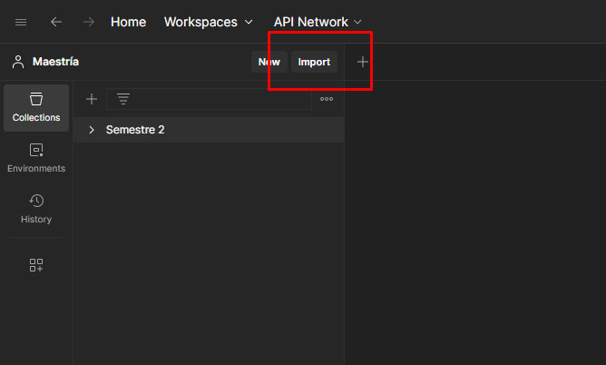
    - Haga clic dónde dice '`files`'.
    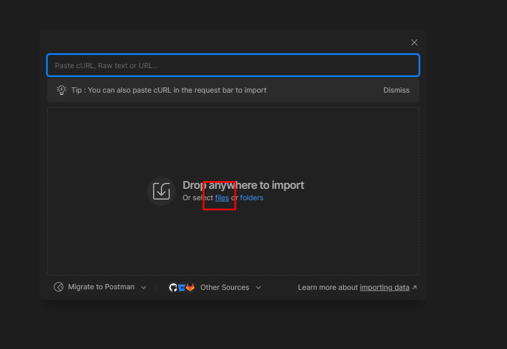
    - Seleccione el archivo [Experimento Seguridad.postman_collection.json](Experimento%20Seguridad.postman_collection.json) y haga clic en abrir.
    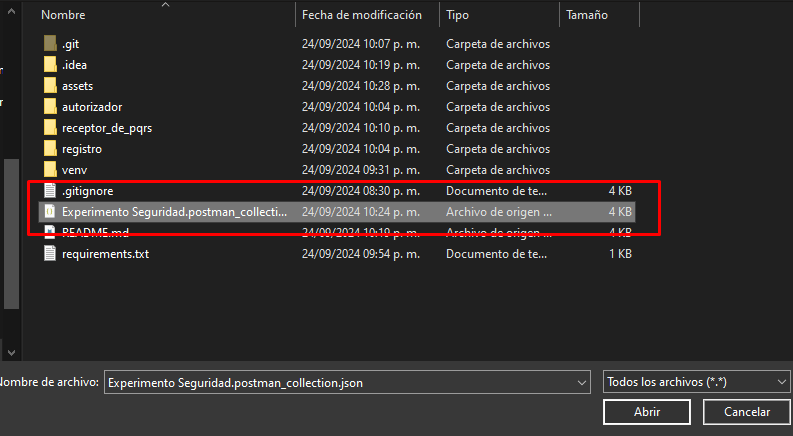
    - Al terminar deberá tener la colección como se muestra en la siguiente imágen.  
    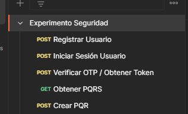
3. Registre un usuario utilizando la request '`Registrar Usuario`', en el apartado '`body`' ingrese un nombre de usuario y contraseña deseados.
    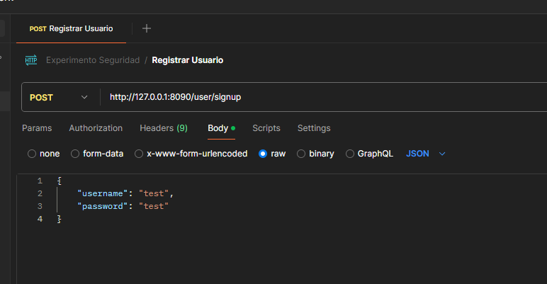

    Si el usuario se registro exitosamente, deberá tener un mensaje de confirmación como se muestra a continuación.
    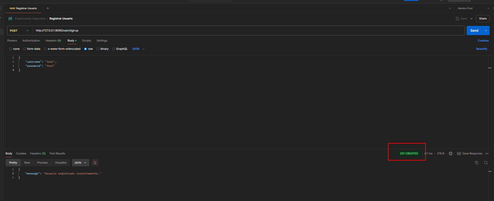

    En caso de registrar un nombre de usuario ya existente, obtendrá el siguiente mensaje de error.
    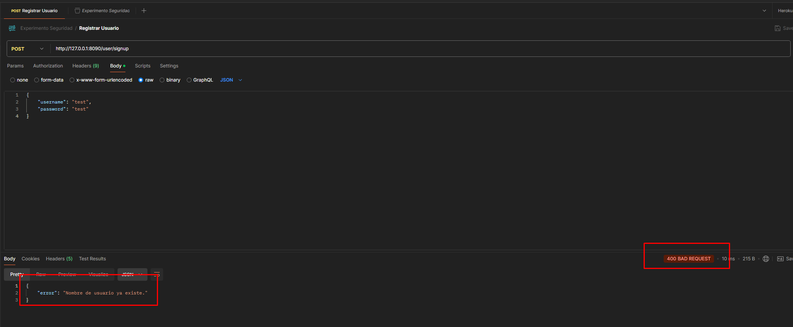
4. Inicie sesión con el usuario previamente creado con la request '`Iniciar Sesión Usuario`', en el apartado '`body`' ingrese los datos suministrados anteriormente.

    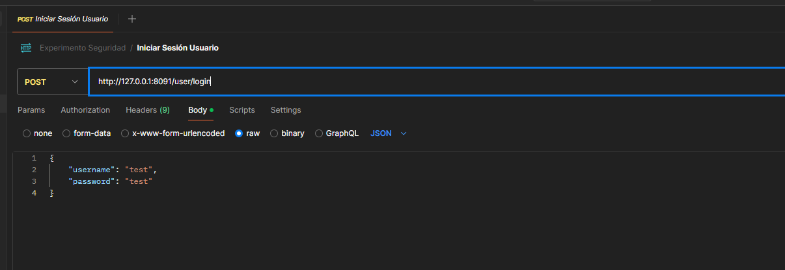

    Si el usuario inició sesión exitosamente, deberá tener un mensaje de confirmación como se muestra a continuación.
    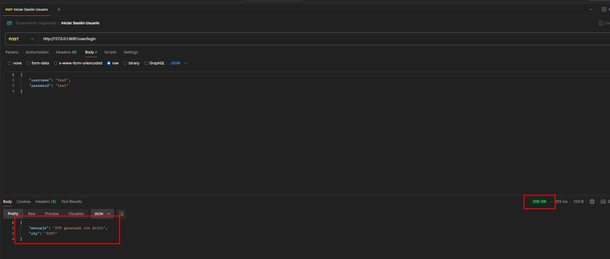

    En caso de suministrar información no registrada, obtendrá el siguiente mensaje de error.
    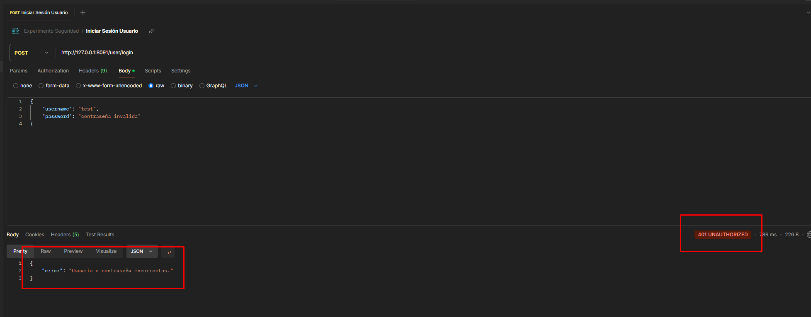
5. Obtener el `token` utilizando la request '`Verificar OTP / Obtener Token`', en el apartado '`body`' ingrese el `Código OTP` generado previamente.

    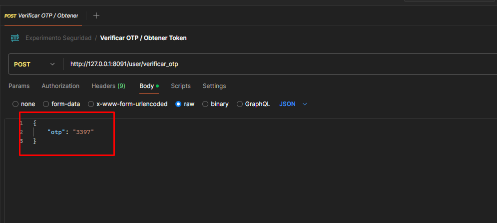

    Si el `Código OTP` suministrado es válido, obtendrá un `token de autenticación` que le permitirá realizar las diversas operaciones sobre los PQRS.
    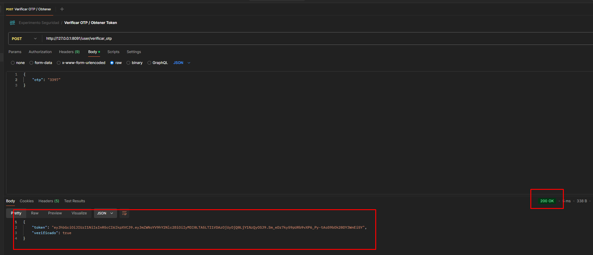

    De lo contrario, obtendrá el siguiente mensaje de error.
    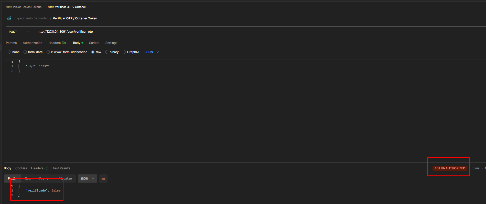

    En caso de que no exista el `Código OTP`, obtendrá un mensaje que indica el error por parte del usuario.

    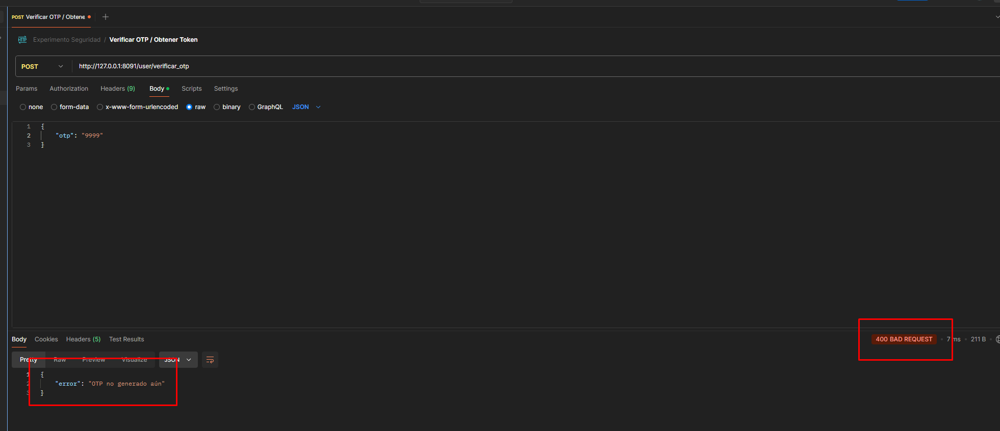

6. Consultar los PQRS utilizando la request '`Obtener PQRS`', en el apartado '`Authorization`' escoja la opción '`Bearer Token`' e ingrese el `Token` generado previamente.

    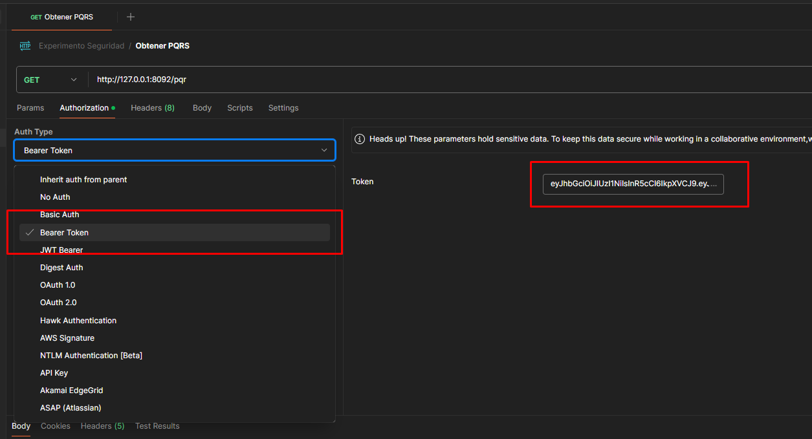

    Si el `Token` suministrado es válido, obtendrá la información correspondiente a las PQRS, como se muestra a continuación. 
    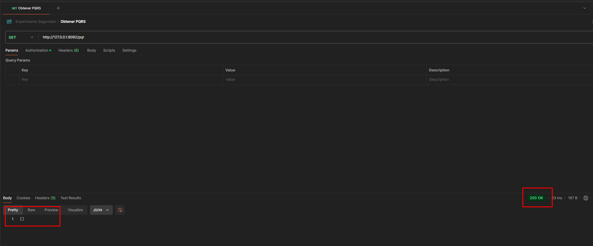

    De lo contrario, obtendrá el siguiente mensaje de error.
    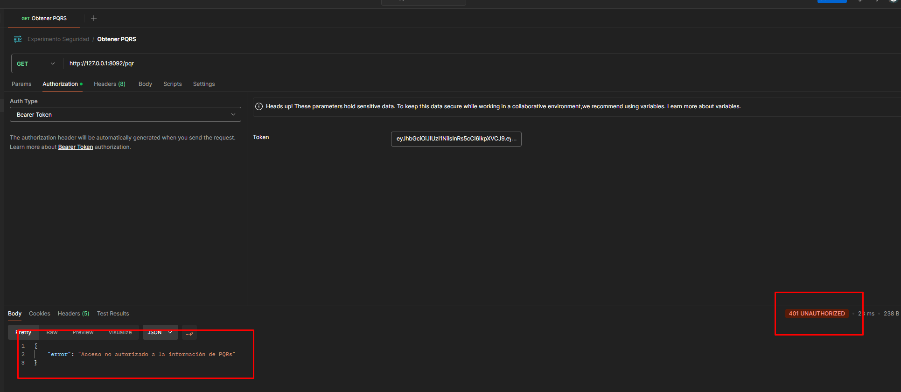

7. Crear una PQR utilizando la request '`Crear PQR`', en el apartado '`Authorization`' escoja la opción '`Bearer Token`' e ingrese el `Token` generado previamente y en el apartado '`body`' ingrese los datos correspondientes para crear una PQR.

    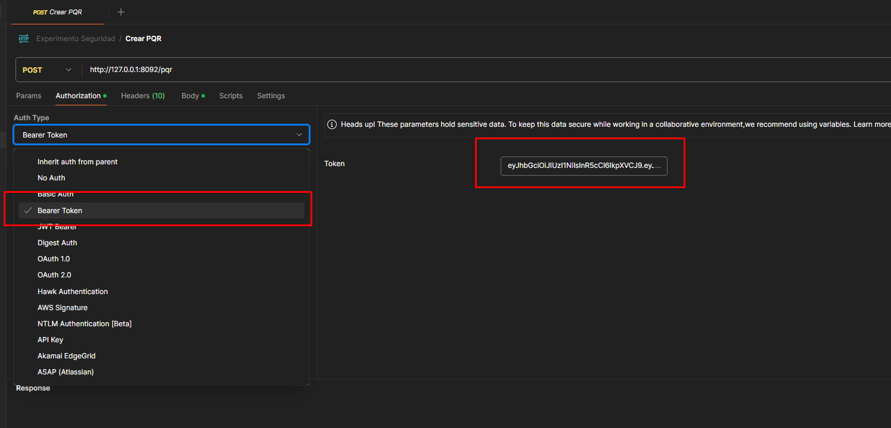

    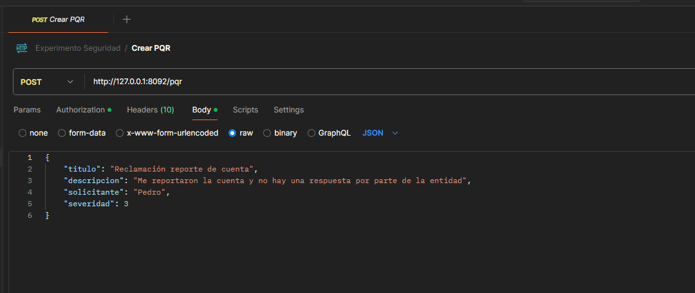

    Si el `Token` suministrado es válido, podrá crear un PQR, como se muestra a continuación. 
    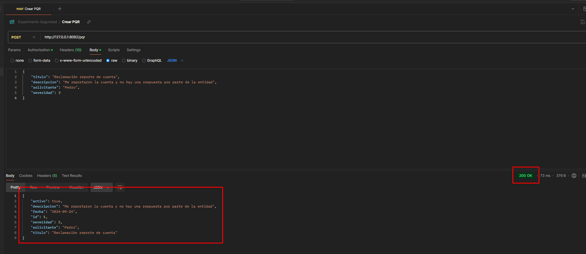

    De lo contrario, obtendrá el siguiente mensaje de error.    
    
    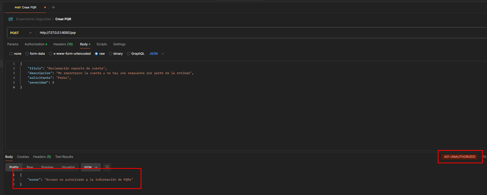

    Para verificar que el PQR se creo exitosamente, utilice nuevamente la request '`Obtener PQRS`' con un `Token` valido .
    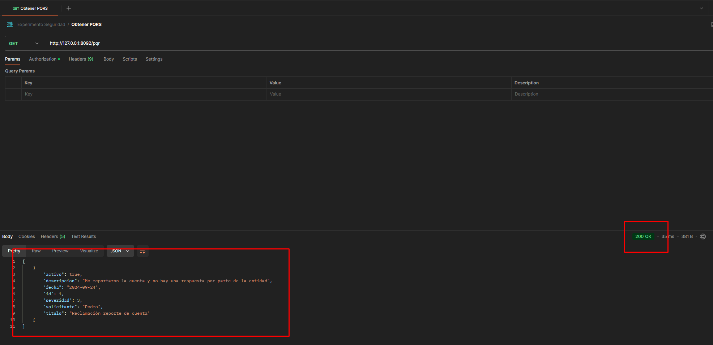

    **Nota:** Si vemos el paso 6, podemos darnos cuenta de que al momento de la ejecución no existía ningún PQR y por eso nos retornaba una lista vacia. Si creamos un PQR y volvemos a realizar este paso, podemos evidenciar la integridad de la información.

## Conclusión

El uso de un autorizador basado en códigos OTP nos proporciona una capa adicional de seguridad lo que contribuye de manera significativa a proteger tanto la integridad como la confidencialidad de la información. Al generar contraseñas únicas y temporales, se reduce considerablemente el riesgo de ataques de interceptación y reutilización de credenciales. Esto refuerza la autenticación de los usuarios, garantizando que solo aquellos autorizados puedan acceder a los datos sensibles, en este caso la información de las PQRS.

## License

Copyright © MISW4202 - Arquitecturas ágiles de software - 2024.